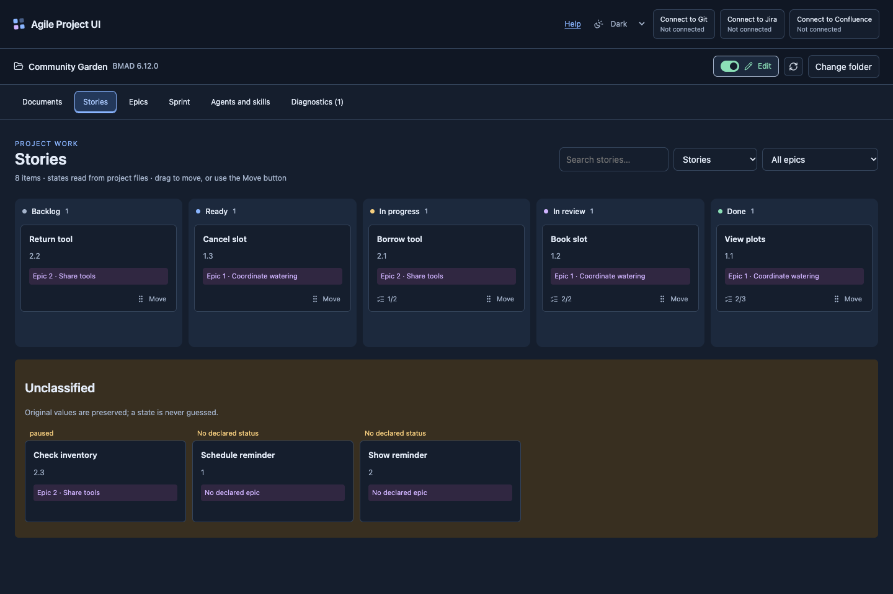
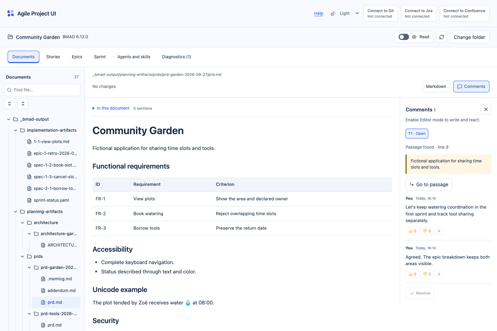
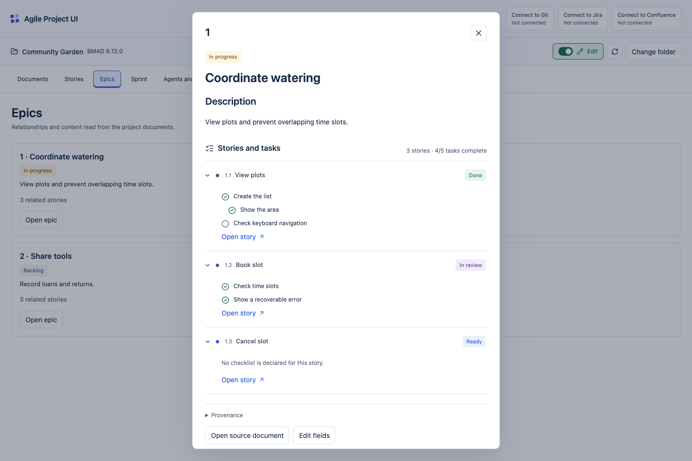
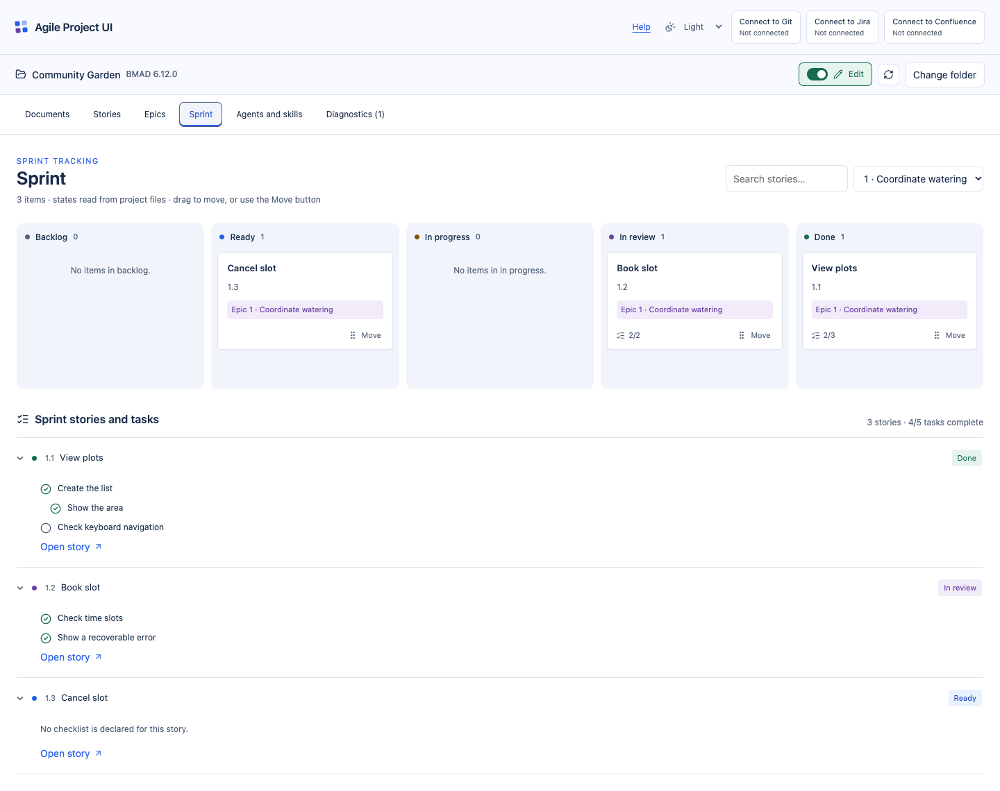

# Agile Project UI

A local-first workspace for documents, stories and sprints. Compatible with BMAD Method.

Read, edit and discuss your project in a browser. Browse documents, move stories, inspect epic and sprint tasks, and keep every change in the project's files.

[Open the app](https://agile-project-ui.enzovalley9.workers.dev) · [MIT license](LICENSE) · [Releases](https://github.com/enzovalley9/agile-project-ui/releases) · [CI](https://github.com/enzovalley9/agile-project-ui/actions/workflows/ci.yml) · [Contributing](CONTRIBUTING.md)

Agile Project UI is an independent project and is not affiliated with, endorsed by, approved by or certified by BMad Code, LLC. It does not run BMAD agents or workflows. Its structured adapter targets **BMAD Method 6.12.0**; other versions retain generic reading with visible compatibility limits.

## Beta scope and first steps

**Public beta:** the full local-folder workflow supports desktop Chrome and Edge. Other browsers can explore the built-in read-only demo or import a text snapshot when their folder picker allows it. Jira and Confluence remain experimental, with production remote writes disabled. See the [support matrix](docs/compatibility.md).

1. [Open the app](https://agile-project-ui.enzovalley9.workers.dev) and choose **Try the demo**. No account or installation is needed.
2. [Download the original example ZIP](https://agile-project-ui.enzovalley9.workers.dev/example/community-garden.zip), extract it and open that folder in Chrome or Edge. Enable edit mode, save a change and inspect the original file.
3. Optionally install the Git connector, review a local commit and push when ready. Follow the [first-use walkthrough](docs/first-use.md).

## Features

- **Documents:** searchable file tree, Markdown rendering, source editing, headings, relative links and local images.
- **Work:** story boards, epic details and sprint views with expandable task lists. Move stories by drag and drop or keyboard, then review the source changes before saving.
- **Discussion:** comments on text fragments, replies, reactions and resolved threads, saved in versionable sidecar files.
- **Appearance:** light, dark and system themes, with a separate switch for read and edit modes.
- **Native Git:** optional local connector for reviewed commits, existing-branch changes and pushes. Save, commit and push remain separate actions.
- **Jira and Confluence:** independent optional connectors for linking, reading, comparing and reviewed local imports, with explicit provider limits.

## See it in action

These screenshots show the included fictional [Community Garden project](tests/fixtures/community-garden). [Open the app](https://agile-project-ui.enzovalley9.workers.dev) to explore your own project in Chrome or Edge.

### Stories and dark mode

See stories grouped by status, filter the board, and switch between light, dark and system themes. In edit mode, drag stories to another state or use the keyboard controls, then review the affected files before confirming the move.



### Documents and comments

Browse the file tree, read formatted Markdown and discuss specific passages in a side panel. Comments, replies and reactions stay in versionable files inside your project. Switch to edit mode to change document text visually or in the Markdown source editor.



### Epics and their tasks

Open an epic to see its related stories, expand their task lists and check completion markers. Each story opens directly from the list, with links back to its source files.



### Sprint overview

Review the sprint board and the task lists beneath it, or filter by epic as shown here. Move stories in edit mode while keeping sprint tracking and source documents consistent through the change review.



## Quick start

Use desktop **Chrome or Microsoft Edge**. The application needs the browser's directory-access API and a secure origin: HTTPS or localhost. Firefox, Safari and mobile browsers are not supported for the complete local-folder workflow.

Open [Agile Project UI](https://agile-project-ui.enzovalley9.workers.dev), select your project root and start reading. Turn on edit mode to save changes; Chrome or Edge will request permission for that folder. The public app requires no account or local installation for reading, editing and comments. Git, Jira and Confluence use the optional local connectors described below.

For local development, install **Node.js 24 LTS**, npm and Git. [`.node-version`](.node-version) pins the tested runtime.

```sh
git clone https://github.com/enzovalley9/agile-project-ui.git
cd agile-project-ui
npm ci
npm run dev
```

Open **http://127.0.0.1:5173**, select your project root and start reading. Turn on edit mode when you want to save changes; the browser will request write permission. No connector is needed to read, edit or comment on local documents.

The built-in demo and [downloadable example](https://agile-project-ui.enzovalley9.workers.dev/example/community-garden.zip) contain original synthetic planning documents, stories, epics and a sprint. The broader test fixtures also cover comments and unsupported/malicious inputs. Installing or running BMAD is unnecessary to open the example.

The GitHub repository and release downloads are public; no GitHub account is required to read the source or download connector packages. See [release access and verification](docs/releases.md).

## Install with Docker

The Docker image packages the web app, Git, Node.js and all three optional connectors. Run one service per container: the web app starts by default; Compose profiles add Git, Jira and Confluence independently. You still open the project folder in desktop Chrome or Edge on the same computer.

Run the GHCR image without a source checkout or local Node.js installation:

```sh
docker run -d --name agile-project-ui --init \
  --read-only --cap-drop ALL --security-opt no-new-privileges \
  --tmpfs /tmp:rw,noexec,nosuid,size=64m \
  -p 127.0.0.1:8080:8080 ghcr.io/enzovalley9/agile-project-ui:latest
```

Open **http://127.0.0.1:8080**. The public image can be used without cloning the source repository. If a pull is denied, check the package visibility/tag or follow the guide to build from a source checkout. The web app needs no project mount or secrets. Optional connectors use private state folders; Git mounts the same host repository you open in the browser, and Jira/Confluence mount separate credential files read-only. Configure paths, exact app origin, provider URLs and deployments in `.env`; credentials belong in private files, never build arguments or the image.

The [Docker guide](docs/docker.md) covers running a published image without a source checkout, extracting its included Compose files, variables, Linux/Docker Desktop ownership, connector setup, Git authentication, updates and registry mirrors. Docker packaging preserves the [current provider limits](docs/atlassian-connectors.md).

## Your files stay in your project

The frontend runs in your browser. The hosting service delivers the application's static files; it does not receive the project you select. There is no account requirement, hosted project database or background synchronization.

- Documents and task states remain authoritative in their original files.
- Comments live in `.bmad-project-ui/comments/threads`, outside `_bmad-output`.
- Browser-private storage holds auxiliary recovery copies and verified comparison bases. Theme preferences are local to the browser.
- Optional connectors run on your computer. Native Git packages use your installed Git; the Docker image includes its own Linux Git. Jira and Confluence contact their configured providers with credentials kept outside the browser and project.

Rendered documents block active HTML and do not automatically load remote images. The browser checks source revisions before writing and verifies the result. External changes retain your draft for review. A partial write blocks further mutations until recovery is resolved.

Unsaved drafts live in the current tab. Export them before closing if needed. Clearing browser storage can remove recovery copies. Browser locks coordinate app tabs, not arbitrary external editors. Comment identity is locally declared; it is not team authentication.

### Compatibility with existing project data

Existing projects keep the historical `.bmad-project-ui` data namespace for comments, integration records and local recovery metadata. Private operation journals and browser storage identifiers also retain their existing names so the rename does not hide saved discussions or unresolved operations. These are compatibility identifiers, not the product name. Do not rename or delete those files to update Agile Project UI.

New connector packages, installed application folders and launcher commands use the Agile Project UI name. The session and credential paths in the setup guide are explicit examples under `~/.agile-project-ui`; an existing private path remains valid when passed through the corresponding command-line option.

See [privacy and local data](docs/privacy.md), [architecture and data boundaries](docs/architecture.md) and the [security policy](SECURITY.md).

## Optional connectors

[Download connector packages](https://github.com/enzovalley9/agile-project-ui/releases) and follow the [step-by-step setup guide](docs/connector-setup.md). The same instructions are available from each connection panel. Packages bundle Node.js for supported macOS, Windows and Linux targets; Git must be installed separately.

| Connector  | What it accesses                                                         | Current behavior                                                                                                                           |
| ---------- | ------------------------------------------------------------------------ | ------------------------------------------------------------------------------------------------------------------------------------------ |
| Git        | One explicitly bound local repository and your native Git configuration. | Review and verify commits, changes to existing local branches and outgoing pushes. No force push, automatic pull or visual merge resolver. |
| Jira       | Your configured Jira instance and selected project.                      | Read, link, compare, prepare exports and review local imports. Production remote writes are blocked.                                       |
| Confluence | Your configured Confluence instance and selected space.                  | Read, link, compare, prepare exports and review local imports. Production remote writes are blocked.                                       |

Jira and Confluence do not read project files or run Git. Production writes remain blocked where an adapter cannot establish the required atomic update or draft-preservation guarantees. Mock providers exercise publication and recovery; they do not establish live tenant compatibility. No live Atlassian account was used for acceptance.

Git repository trust permits native hooks, filters, signing tools and credential helpers. Only trust repositories and native programs you intend to run. Packages are **unsigned and not notarized**; checksums verify integrity, not publisher identity.

Details: [Git](docs/git-connector.md) · [Jira and Confluence](docs/atlassian-connectors.md).

## Compatibility and limits

| Content                                    | Support                                                                                                      |
| ------------------------------------------ | ------------------------------------------------------------------------------------------------------------ |
| Markdown                                   | Rendered reading, source editing and comments. Active HTML is blocked.                                       |
| YAML, TOML, JSON, CSV, TXT, MDX, HTML, XML | UTF-8 source. Structured views appear only where an adapter exists; templates and components do not execute. |
| PNG, JPEG, GIF, WebP                       | Markdown-referenced local images within authorized roots, up to 8 MiB.                                       |
| SVG, PDF and other attachments             | Excluded from the text inventory with diagnostics; not executed or edited.                                   |

Text scans are bounded to 2 MiB per file, 32 MiB per inventory, 5,000 files and 20 directory levels. Limits, read failures, unknown formats and ambiguous work items are reported as diagnostics. Secret, tool and dependency paths and nested repositories are excluded. These exclusions are not a complete secret scanner.

Derived documents can be edited with a regeneration warning. Changes do not silently rewrite memlogs or invent states. Files with unresolved merge markers remain read-only source until resolved externally.

## Build and test

```sh
npm run check
npm run format:check
npm run notices:check
npm run audit:dependencies
npm run test:release
npx playwright install chromium
npm run test:e2e
```

The build writes the static application to `dist/web` and Node connectors to `dist/connectors`. CI checks macOS, Linux and Windows, including installed connector packages, and runs browser journeys in Chromium and Edge. The [testing guide](docs/testing.md) separates automated fixtures, native browser acceptance and live-provider evidence.

For a local production preview after building:

```sh
npx vite preview --config apps/web/vite.config.ts
```

Open **http://127.0.0.1:4173**. Restart any connector with this exact origin; browser permissions and private storage are origin-specific.

## Hosting

The frontend supports Cloudflare Workers Static Assets, including public installation and help pages. Only the static build is uploaded; project files and optional connectors remain on each visitor's computer. See the [hosting guide](docs/hosting.md) for account selection, free static delivery, deployment, browser permissions, verification and rollback.

## Contributing and support

Start with [CONTRIBUTING.md](CONTRIBUTING.md), the [development guide](docs/development.md) and the [code of conduct](CODE_OF_CONDUCT.md). Maintained code, comments, documentation and examples use English. The application preserves the original language of users' files and includes deliberate Unicode regression coverage.

Use [SUPPORT.md](SUPPORT.md) for troubleshooting and sanitized bug reports. Report vulnerabilities through the route described in [SECURITY.md](SECURITY.md), not a public issue. Release changes are recorded in [CHANGELOG.md](CHANGELOG.md). The [roadmap](docs/roadmap.md) lists current priorities and starter contributions; the [maintainer guide](docs/maintaining.md) explains review, security setup and release acceptance.

For questions, suggestions or help, contact **Enzo Valley** at [enzovalley9@gmail.com](mailto:enzovalley9@gmail.com).

## License and attribution

First-party code, documentation and synthetic examples are available under the **[MIT License](LICENSE)**, copyright 2026 Enzo Valley. Preserve the copyright and permission notice when redistributing copies or substantial portions.

Dependencies retain their own licenses. [`THIRD_PARTY_NOTICES.md`](THIRD_PARTY_NOTICES.md) contains the locked dependency notices, including Lucide/Feather attribution. Web builds and connector archives include the project license and these notices; connector packages also retain Node's license at `runtime/LICENSE`.

BMad and BMad Method are trademarks of BMad Code, LLC. This project's MIT license does not grant rights to third-party names, logos or branding. See the upstream [trademark guidelines](https://github.com/bmad-code-org/BMAD-METHOD/blob/main/TRADEMARK.md).
